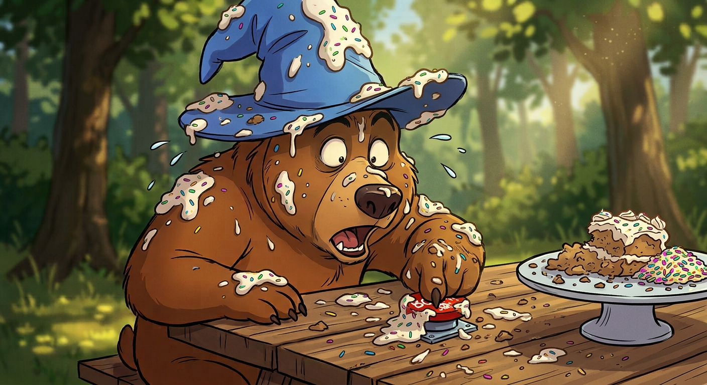
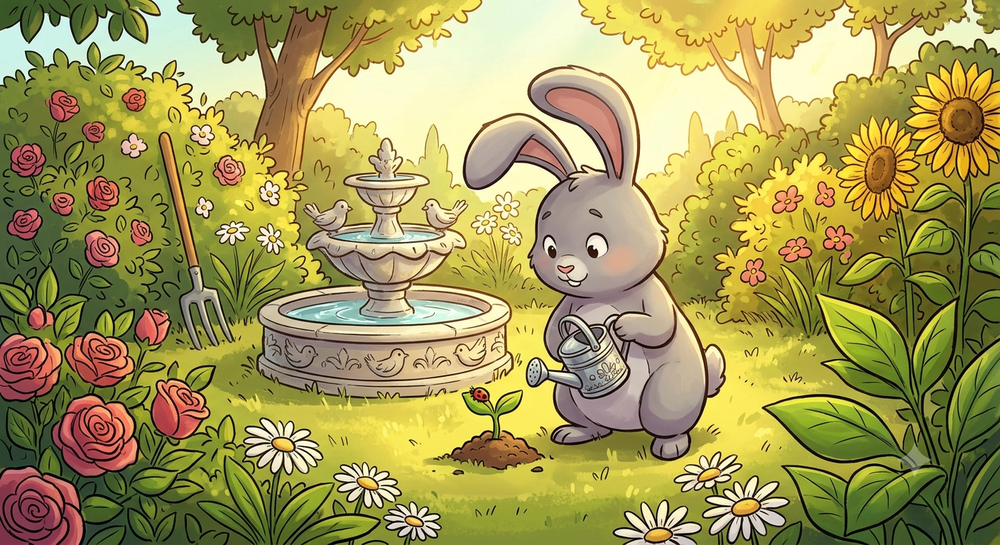
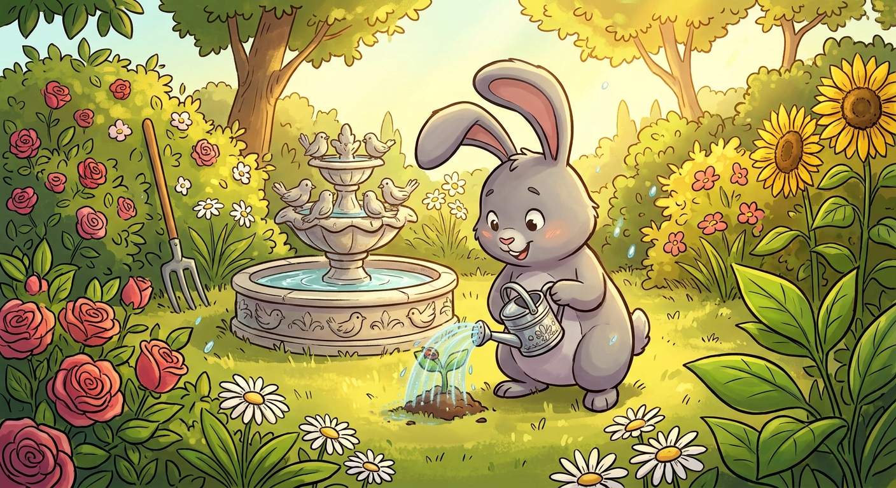
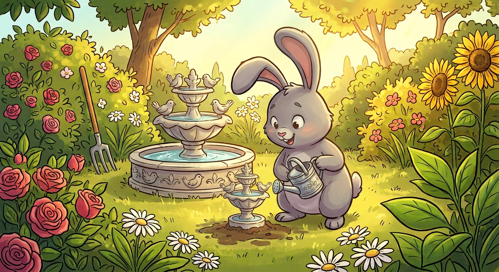
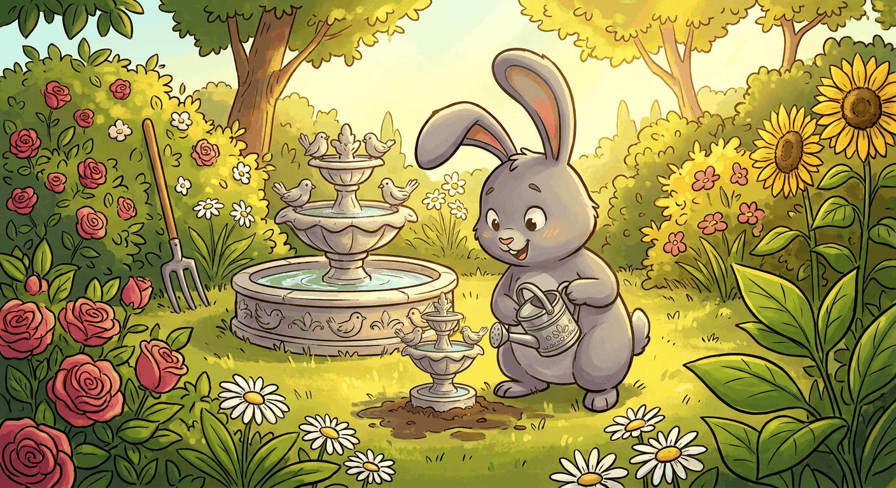

# Image to GIF Converter

A small project exploring two different ways to turn a set of static images into an animated GIF: a simple hardcoded version, and a more flexible version with a file picker.


Image Source: Gemini AI

## Project Structure

```
Image_to_GIF/
├── .venv/                      # Virtual environment (not tracked in git)
├── Dynamic/                    # Dynamic version — pick any images via a file picker
│   ├── DynamicGIF.py
│   ├── IMAGE.gif
│   └── Readme.md
├── Images/                     # Shared sample image sets used across both versions
│   ├── Bear/
│   │   ├── F1.png
│   │   ├── F2.jpg
│   │   ├── F3.jpg
│   │   └── F4.jpg
│   └── Rabbit/
│       ├── R1.png
│       ├── R2.jpg
│       └── R3.jpg
├── StaticImageToGIF/            # Static version — fixed, hardcoded image list
│   ├── Bear.gif
│   ├── IMAGEtoGIF.py
│   └── Readme.md
├── Readme.md                    # This file — project overview
└── requirements.txt
```

## The Two Versions

| | [StaticImageToGIF](StaticImageToGIF/Readme.md) | [Dynamic](Dynamic/Readme.md) |
|---|---|---|
| **Input** | A fixed, hand-typed list of file paths | Any number of images, chosen live through a file picker popup |
| **Flexibility** | Must edit the code to change which images are used | No code changes needed — just pick different files each run |
| **Best for** | Understanding the core image-to-GIF logic in its simplest form | Actual day-to-day use with varying image sets |

The static version was built first, to get the core logic (open images → standardize format → combine into a GIF) working end to end. The dynamic version builds on that same core logic, replacing the hardcoded list with a live file-selection step.

## Examples

### Static version — `Bear/` set

| F1.png | F2.jpg | F3.jpg | F4.jpg |
|---|---|---|---|
|  |  |  |  |


### Dynamic version — `Rabbit/` set

| R1.png | R2.jpg | R3.jpg |
|---|---|---|
|  |  |  |



These are just example runs to show what to expect — the Dynamic version isn't limited to this set, it can use any images you select at runtime.

## Requirements

All dependencies for both versions are listed in the root [`requirements.txt`](requirements.txt):

```bash
pip install -r requirements.txt
```

`tkinter` (used only by the Dynamic version) is not listed here since it ships with Python itself and isn't installed via pip.

## Sample Assets

The `Images/` folder contains two sample sets (`Bear/` and `Rabbit/`) used to test and demo both versions.